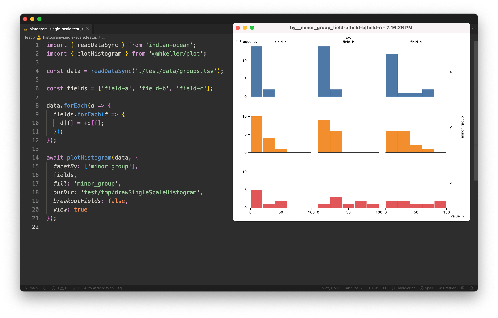

Plot
===

> A small node library to display charts in popup windows and save them as pngs

- [Installing](#installing)
- [Functions](#functions)
- [Examples](#examples)
- [Troubleshooting](#troubleshooting)





## Installing

It's not yet on npm so install with the below command but import it with `import { plot, plotHistogram } from '@mhkeller/plot'`.

```
npm install mhkeller/plot
# later when it's on npm, you can do npm install @mhkeller/plot
```

## Functions

**plot(** `plotFunction: Function, args: Array, options: Object` **)**

A generic function to render HTML, view and screenshot it. 

```js
import { plot } from '@mhkeller/plot`;

// Create a function that returns html
const chart = ds => Plot.plot({
  marks: [
    Plot.rectY(
      ds, 
      Plot.binX(
        { y: 'count' }, 
        {
          x: 'date', 
          y: 'value', 
          fill: 'blue', 
          thresholds: 10
        }
      )
    )
  ]
});

await plot(chart, [data], { 
 outPath: 'chart.png',
 view: true
});
```

*Arguments*

* **chart** `{Function}`
  * A function that accepts a dataset and returns a function that renders a chart. **(required)**
* **arguments** `{Function}`
  * An array of arguments that go into your chart function. This will be the data plus any others you may need. **(required)**
* **options** `{Object}`
  * An options object.
* **options.library** `{String|String[]='observablehq/plot'}`
  * Specify what library to load to render the plot. Built-in options are `'observablehq/plot'`, `'tfjs'` and `'plotly'`. To use your own, add in the URL of the script to load in the browser and it will be injected as the `src` of a `<script>` tag. This field can also be an array of URLs if you need to add multiple scripts.
* **options.outPath** `{String='chart.png'}`
  * A filepath to write the image.
* **options.view** `{Boolean=false}`
  * If true, show the chart in a popup window.
* **options.title** `{String='My chart'}`
  * If `view` is true, add a title to the window's page.
* **options.css** `{String}`
  * Any CSS that you want injected into the page to tweak styles.
* **options.debug** `{Boolean = false}`
  * Whether to run the screenshot browser in headfull mode.

**plotHistogram(** `data: Array, { facetBy: String[], fields: String{}, outDir: String[, name: String, fill: String='#000', css: String, view: false] } }` **)**

A more specific function that takes data, a list of fields to facet by and a list of fields to compute values for. Writes a screenshot.

```js
import { plotHistogram } from '@mhkeller/plot`;

plotHistogram(data, { 
 facetBy: ['group'], 
 fields: ['value', 'value2'], 
 outDir: 'out_images', 
 name: 'my-charts', 
 fill: 'group', 
 view: true
});
```

*Arguments*

* **data** `{Array}`
  * Your data to render. **(required)**
* **options** `{Object}`
  * An options object.
* **options.facetBy** `{String[]}`
  * An array of field names to facet by. These facets are not combined, it's just a shorthand for running multiple facets at a time, done separately in succession. **(required)**
* **options.fields** `{String[]}`
  * An array of fields to compute histogram values for. **(required)**
* **options.outDir** `{String}`
  * The *directory* – not a specific file name – to write the various files out to. **(required)**
  * Filenames are generated according to the convention: 
    * With a `name` supplied: `${name}_by__${facet}_${field}.png`;
    * With no `name` supplied: `by__${facet}_${field}.png`;
    * If `breakoutFields=false` `_${field}` is a concatenation of all fields separated by a `|` character.
    * If `columns=false`, the file name will end in `_lines.png`.
* **options.fill** `{String}`
  * A hex code or field name. Defaults to `'#000'`.
* **options.view** `{Boolean=false}`
  * If true, show the chart in a popup window.
* **options.title** `{String='My chart'}`
  * If `view` is true, add a title to the window's page.
* **options.css** `{String}`
  * Any CSS that you want injected into the page to tweak styles.
* **options.breakoutFields** `{Boolean=true}`
  * For each field passed into `options.fields` write out a separate PNG. Set this to false to put everything on the same scale.
* **options.columns** `{Boolean=true}`
  * Draw the histogram as columns, like a regular histogram. If this is `false`, just draw semi-opaque lines, which can be useful for seeing density.
* **options.debug** `{Boolean = false}`
  * Whether to run the screenshot browser in headfull mode.

## Examples

See the [test](./test/) folder for more.

## Troubleshooting

If you go from a double monitor to just your laptop, the `view` option may result in Chrome not responding and it won't display all of your charts. To fix it, put your monitor to sleep and re-open it.
